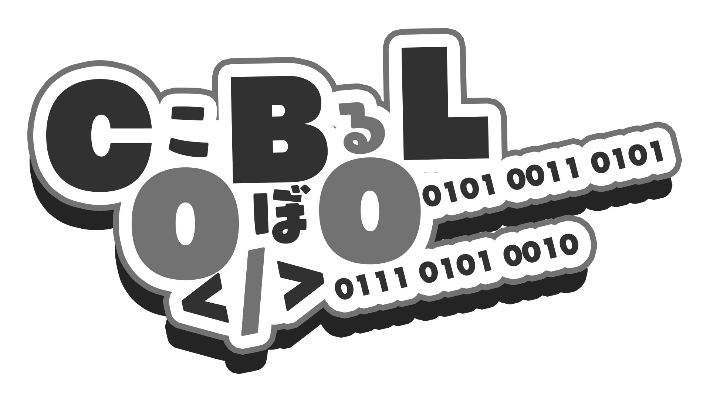
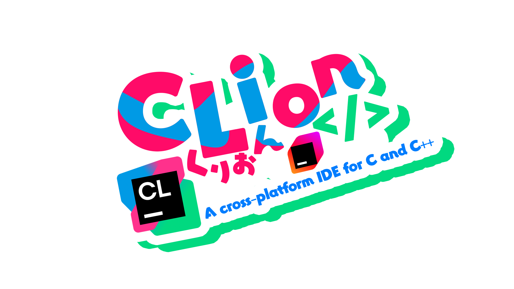
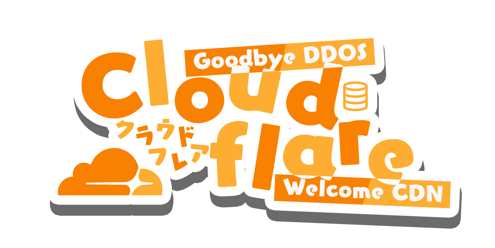
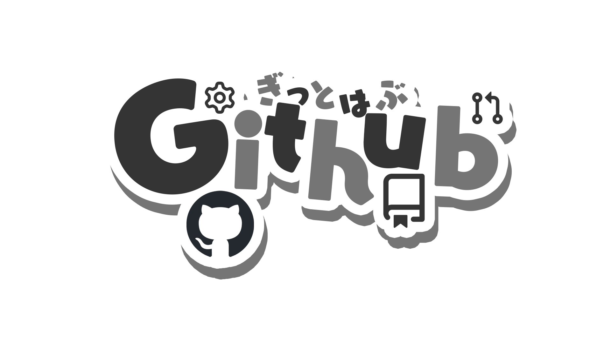
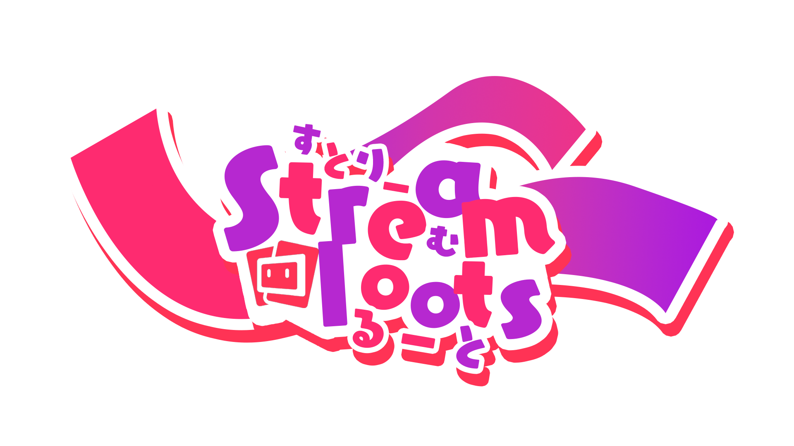

# Image List

Here's a list of images available in the `images` sub-folder:

| Name               | Application Description                                                  | Image                                               |
|--------------------|--------------------------------------------------------------------------|-----------------------------------------------------|
| Angular            | Front-end JavaScript framework for building single-page web applications|                       |
| AngularNewLogo     | New Angular logo                                                        |         |
| Arch Linux         | Linux distribution known for its simplicity and flexibility             |               |
| Astro              | Astro logo                                                               |                           |
| C                  | General-purpose programming language                                     |                                   |
| COBOL              | Programming language primarily used in business, finance, and government |                           |
| Clion              | Integrated development environment for C and C++                          |                           |
| Cloudflare         | Web infrastructure and website security company                          |                 |
| Croud              | Croud logo                                                               |                           |
| Figma              | Collaborative interface design tool                                      |                           |
| FlutterTransparent| Transparent Flutter logo                                                | |
| Github             | Web-based hosting service for version control using Git                  |                         |
| Gitlab             | Web-based DevOps lifecycle tool that provides a Git repository manager  |                         |
| Golang             | Programming language designed for building simple, reliable, and efficient software |                |
| HTML               | Standard markup language for creating web pages                          |                             |
| Haskell            | Functional programming language with strong static typing                |                       |
| Hono               | Hono logo                                                                |                             |
| JUNIPERTRANS       | Transparent Juniper logo                                                |             |
| JavaTransparent   | Transparent Java logo                                                   |       |
| Kotlin             | Cross-platform programming language that runs on the Java Virtual Machine|                         |
| LaravelTransparent| Transparent Laravel logo                                                | |
| MUIT               | MUIT logo                                                                |                             |
| Next.js            | JavaScript framework for building static and server-side rendered applications|                |
| Node.js            | JavaScript runtime built on Chrome's V8 JavaScript engine                |                       |
| Photoshop          | Image editing software                                                   |                   |
| Python             | High-level programming language known for its simplicity and readability |                         |
| Qwik               | Qwik logo                                                                |                             |
| RStudioTransparent| Transparent RStudio logo                                                 | |
| Raspberry Pi       | Low-cost, credit-card-sized computer                                     |          |
| React              | JavaScript library for building user interfaces                          |                           |
| RhineLab           | RhineLab logo                                                            |                     |
| Rider              | Cross-platform .NET IDE                                                  |                           |
| Ruby               | Dynamic, open-source programming language                                |                             |
| Rust               | Systems programming language known for its memory safety                  |                             |
| Streamloots        | Streamloots logo                                                         |               |
| SwiftTransparent  | Transparent Swift logo                                                   |     |
| Tailwindcss6       | Utility-first CSS framework                                              |             |
| TeamSpeak          | VoIP communication software                                              |                   |
| TransparentGNU     | Transparent GNU logo                                                     |         |
| UnityBlenderT      | Transparent Unity Blender logo                                           |           |
| VIMTRANS           | Transparent Vim logo                                                     |                     |
| VRChatTransparent  | Transparent VRChat logo                                                  |   |
| Vite               | Build tooling framework for modern web development                        |                             |
| VoiceMod           | VoiceMod logo                                                            |                     |
| Vue                | Progressive JavaScript framework for building user interfaces             |                               |
| WALLHACK           | WALLHACK logo                                                            |                     |
| X                  | X logo                                                                   |                                   |
| htmx               | htmx logo                                                                |                             |
